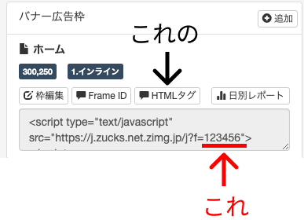

# vue-zucks-ad-banner (非公式)

## これは何？

これはVue.jsで[Zucks Ad Network](https://zucks.co.jp/publisher/adnetwork/)のWebバナー広告を表示するためのVueコンポーネントです。  
**非公式です**(規約的にNGでしたらすぐに消します)。  

公式から提供されるHTMLタグ（scriptタグ）はVueのコンポーネントでは扱えないため作成しました。

## Getting started

### Installation

```
npm i --save vue-zucks-ad-banner
```

### Use in `main.js`

```js
import VueZucksAdBanner from 'vue-zucks-ad-banner'

Vue.use(VueZucksAdBanner)
```

### Template

```vue
<zucks-ad-banner
    frameId="123456"
    @click="clicked">
</zucks-ad-banner>
```

frameIdは、Zucks管理画面の「HTMLタグ」にあるURLのクエリの`f=?????`の数字を使ってください。（「Frame ID」に表示されてるIDではありません）


